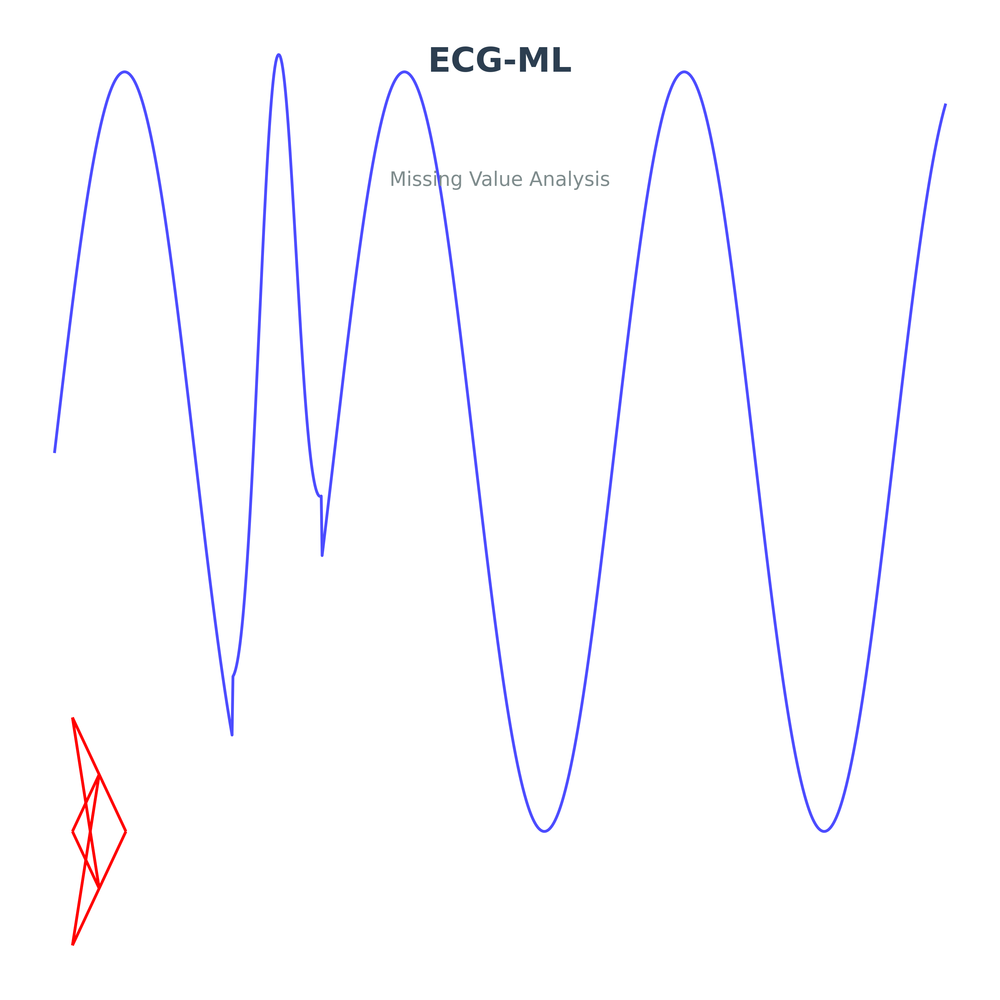
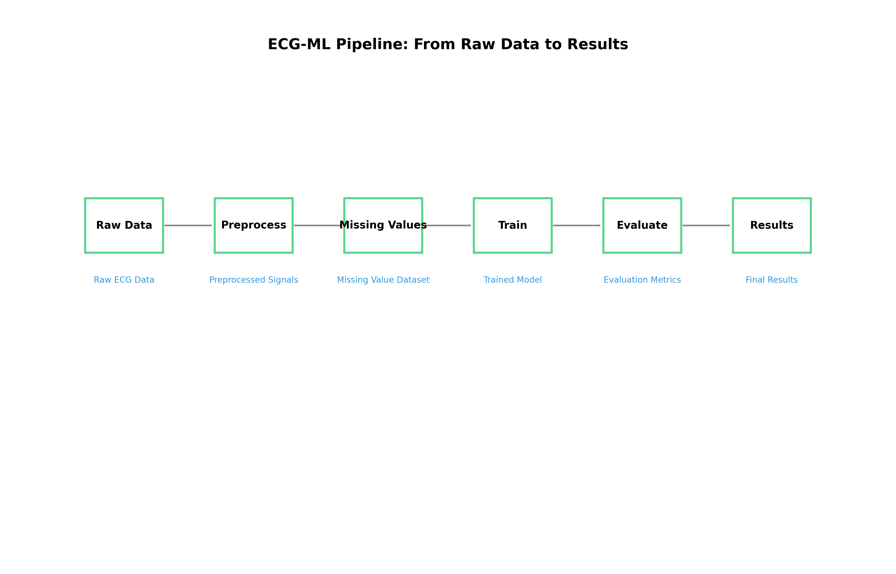

<div align="center">
  
  
  # ECG-ML: Missing Value Analysis and Classification
  
  [](https://opensource.org/licenses/MIT)
  [](https://www.python.org/downloads/)
  [](https://www.tensorflow.org/)
  [](https://wfdb.readthedocs.io/)
  [](https://github.com/psf/black)
  [](https://ecg-ml.readthedocs.io/en/latest/?badge=latest)
  
  *Advanced ECG Signal Processing with Missing Value Analysis and Deep Learning Classification*
</div>

## 📊 Overview

This project implements a comprehensive pipeline for processing, analyzing, and classifying ECG signals. It includes functionality for handling missing values, preprocessing signals, and training deep learning models for ECG classification.

<div align="center">
  
</div>

## 🏗️ Project Structure

```
.
├── data/               # Data directory (gitignored)
│   ├── raw/           # Raw ECG data
│   └── processed/     # Processed ECG data
├── logs/              # Training and processing logs (gitignored)
├── models/            # Trained models (gitignored)
├── results/           # Evaluation results (gitignored)
├── scripts/           # Shell scripts for setup and execution
├── src/               # Source code
│   ├── preprocess_ecg.py
│   ├── train_ecg.py
│   └── preprocess_missing_ecg.py
└── requirements.txt   # Python dependencies
```

## ✨ Features

### 🔍 ECG Signal Processing
- Signal preprocessing and normalization
- Missing value handling and generation
- Multi-lead ECG support
- Configurable preprocessing parameters

### 🧠 Model Training
- Support for multiple classification types:
  - Binary classification
  - Superclass classification
  - Subclass classification
- Configurable model architecture
- Comprehensive logging and monitoring
- Model size analysis and reporting

### 📂 Data Management
- Organized data directory structure
- Support for different lead configurations
- Efficient data loading and processing

## 🚀 Getting Started

### Prerequisites
- Python 3.x
- Git
- Virtual environment (recommended)

### Installation

1. Clone the repository:
```bash
git clone https://github.com/msadeqsirjani/ecg-ml.git
cd ecg-ml
```

2. Create and activate a virtual environment:
```bash
python -m venv env
source env/bin/activate  # On Windows: env\Scripts\activate
```

3. Install dependencies:
```bash
pip install -r requirements.txt
```

## 📝 Usage

### 1️⃣ Data Download

```bash
./scripts/setup_ecg_data.sh
```
This script will:
- Create necessary data directories
- Download the ECG dataset from the source website
- Extract and organize the raw data files

### 2️⃣ Data Preprocessing

```bash
./scripts/setup_preprocess.sh
python src/preprocess_ecg.py
```

### 3️⃣ Missing Value Generation

```bash
./scripts/setup_missing_values.sh
python src/preprocess_missing_ecg.py
```

The missing value generation process:
- Takes 10-second ECG signal segments as input
- Introduces random zero-value noise segments
- Duration of noise segments varies from 1 to 9 seconds
- Multiple noise segments can be added to a single signal
- Preserves the original signal structure while simulating missing data scenarios
- Generates a new dataset with controlled missing value patterns

### 4️⃣ Model Training

```bash
./scripts/setup_training.sh
```

## ⚙️ Configuration

The project supports various configuration options:

| Category | Options |
|----------|---------|
| Lead Configurations | Different combinations of ECG leads |
| Classification Types | Binary, superclass, and subclass classifications |
| Model Parameters | Configurable through the training script |
| Preprocessing Parameters | Adjustable in the preprocessing script |
| Missing Value Parameters | Noise segment duration (1-9 seconds), segment count, distribution |

## 📊 Output

| Output Type | Location | Description |
|------------|----------|-------------|
| Processed Data | `data/processed/` | Preprocessed ECG signals |
| Trained Models | `models/` | Saved model checkpoints |
| Logs | `logs/` | Training and processing logs |
| Results | `results/` | Evaluation metrics and visualizations |
| Model Reports | `results/` | Size analysis and architecture details |

## 📚 Dependencies

- Python 3.x
- NumPy
- Pandas
- TensorFlow
- WFDB
- Scikit-learn
- Matplotlib

See `requirements.txt` for complete list of dependencies.

## 🤝 Contributing

We welcome contributions! Please follow these steps:

1. Fork the repository
2. Create a feature branch (`git checkout -b feature/AmazingFeature`)
3. Commit your changes (`git commit -m 'Add some AmazingFeature'`)
4. Push to the branch (`git push origin feature/AmazingFeature`)
5. Open a Pull Request

## 📄 License

This project is licensed under the MIT License - see the [LICENSE](LICENSE) file for details.

## 📧 Contact

Your Name - [@msadeqsirjani](https://twitter.com/msadrqsirjani) - mohammadsadegh.sirjani@utsa.edu

Project Link: [https://github.com/msadeqsirjani/ecg-ml](https://github.com/msadeqsirjani/ecg-ml)

---

<div align="center">
  <sub>Built with ❤️ by the ECG-ML Team</sub>
</div> 